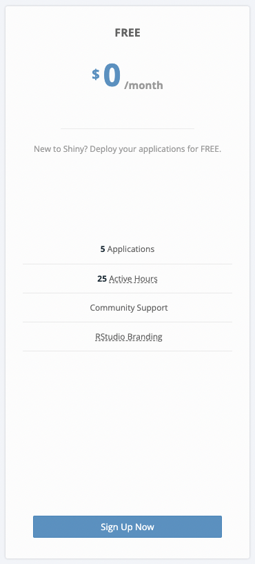
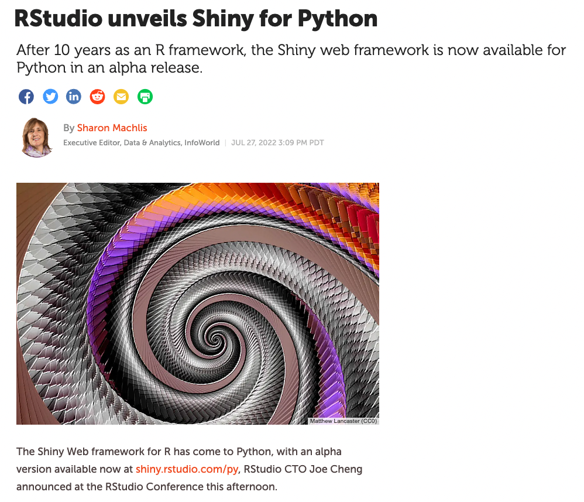

```{r setup, include=FALSE}
knitr::opts_chunk$set(echo = TRUE, fig.width = 6, fig.height = 2.5, warning = FALSE, message = FALSE)
options(width = 12)
```

## Where we got to

Last week we looked at: 

- The end product of an example shiny app 
- Some other examples of finalised shiny apps 

We talked about: 

- Different kinds of inputs available in a shiny app 
- Different kind of outputs 
  - A little about boring outputs vs cool outputs 
- Some of the different layout options within a shiny app 

## Where to go next

This week we will expand on some of these points, and dive a little deeper into what actually happens behind the scenes. 

- Creating a minimally functional application 
- The demo app code
- How the inputs and outputs speak to each other
- How to turn the boring outputs into the cools ones 
- "Reactivity" within shiny apps, and if time
- How you might go about deploying your shiny app, and 
- Shiny in other languages 

## Relationships between UI and Server

The separation between UI and server is kind of like the separation between my two teaching sessions.

The UI is the User Interface. It handles everything that a user can see when they use the application. The code in this section is comparatively fairly simple as it mostly dictate where to put things in the application. 

The server then handles all of the back end processing. It is the thing that take the inputs from the user, and uses them in whatever way the programmer desires in order to construct the outputs. 

## A minimal shiny application 

The code below will produce a blank application with only a title. 

```{r, eval = FALSE}
# load the shiny r package 
library(shiny)
# write the UI object 
ui <- fluidPage(

    # Application title
    titlePanel("A generic application title"),

)
# write the server object 
server <- function(input, output) {

}
# build the app 
shinyApp(ui = ui, server = server)
```

## Inputs and Outputs (1/3)

Let's take our minimally functioning app, and add one input and one output that uses this input. 

We'll add a question with text input, and an output containing the original question and the given answer. 

## Inputs and Outputs - the UI (2/3)

```{r, eval = FALSE}
# load the shiny r package 
library(shiny)
# write the UI object 
ui <- fluidPage(
    # Application title
    titlePanel("A generic application title"),
    fluidRow(
      textInput(inputId = "answer", 
                label = "How do you define a salad??", 
                width = "100%"
      )
    ), 
    fluidRow(
      textOutput(outputId = "sassyOut")
    )
)
```

## Inputs and Outputs - the server (3/3)


```{r, eval = FALSE}
# write the server object 
server <- function(input, output) {

  output$sassyOut <- renderText({
    paste0("I asked you what defines a salad, and you answered '", 
           input$answer, 
           "'. Come on,",
           "surely you can come up with something more robust!")
  })
  
}
```

## Interactivity (1/5)

The difference between interactive and non-interactive outputs is really just a matter of what packages you use to construct them, and what kind of outputs you use.

I used tables and plots. 

## Interactivity (2/5) - Tables

For non interactive tables you would use a combo of:

```{r, eval = FALSE}
# in the UI 
tableOutput()
# in the serve
renderTable()
```

```{r, eval = TRUE, echo = FALSE}
library(pander)
pander(iris[1:3, 1:4])
```

## Interactivity (3/5) - Tables 

For interactive plots, you might instead load the `DT` package and use a combination of:

```{r, eval = FALSE}
# in the UI 
DT::DTOutput()
# in the server
DT::renderDT()
```

```{r, eval = TRUE, echo = FALSE}
DT::datatable(iris[1:3, 1:4], options = list(scrollX = TRUE, scrollY = TRUE), 
              class = 'cell-border stripe')
```

## Interactivity (4/5) - Plots 

For static plots, you might use ggplot2 on it's own (or base plot, but that's gross), meaning a combination of the following would produce the desired outcome.

```{r, eval = FALSE}
# in the UI
plotOutput()
# in the server 
renderPlot()
```

```{r, eval = TRUE, echo = FALSE}
library(tidyverse)
a <- ggplot(data = mtcars, aes(x = wt, y = mpg)) + 
  geom_point() +
  theme_bw() +
  labs(x = "Weight (imperial ton)", 
       y = "Fuel Efficiency (mpg)") +
  theme(
    panel.background = element_rect(fill='transparent', color = NA), #transparent panel bg
    plot.background = element_rect(fill='transparent', color=NA), #transparent plot bg
  )
a
```


## Interactivity (5/5) - Plots 

For interactive plots we would probably use ggplot2 to construct the plot, but then convert it to an interactive plotly object and use this combination... 

```{eval = FALSE}
# in the UI 
plotly::plotlyOutput()
# in the server
plotly::renderPlotly()
```

```{r, eval = TRUE, echo = FALSE}
library(plotly)
a <- ggplot(data = mtcars, aes(x = wt, y = mpg)) + 
  geom_point() +
  theme_bw() +
  labs(x = "Weight (imperial ton)", 
       y = "Fuel Efficiency (mpg)") +
  theme(
    panel.background = element_rect(fill='transparent', color = NA), #transparent panel bg
    plot.background = element_rect(fill='transparent', color=NA), #transparent plot bg
  )
plotly::ggplotly(a)
```

## Reactivity (1/4)

Reactivity is a default feature of R shiny, though it does not always work the way we might like. 

Let's take a look at how our barebones app from earlier functions with the default reactivity. 


## Reactivity (2/4)

It's not great. The text is already there, and blank before we have even typed anything into the output. Then it updates as we type! 

We can fix this. We have the technology. Let's add a button that TELLS R when we actually want to see the output. 

## Reactivity (3/4)

Adding a button to the UI is fairly simple. We're just going to add it onto the end of our input row. 

```{r, eval = FALSE}
# imagine the other wrapper code is still there! 
fluidRow(
  textInput(inputId = "answer", 
            label = "How do you define a salad??", 
            width = "100%"
  ), 
  actionButton(inputId = "genText", 
               label = "Generate Output!"
  )
```

## Reactivity (4/4)

The server requires a bit more rearranging in order to make the button work. We can tell R to "observe" the button press, and use this queue to update a set of "reactive values" and parse this to the output. 

```{R, eval = FALSE}
# inside the server function 
textOut <- reactiveValues(result = NULL)
observeEvent(input$genText, {
  # create the text object we would like the app to render 
  textOut$result <- paste0(
    "I asked you what defines a salad, and you answered with '", 
    input$answer, 
    "'. Surely you can come up with something more robust!")
})
output$sassyOut <- renderText({
  textOut$result 
})
```

## Deployment

:::: {style="display: flex;"}

::: {}

[Shiny Apps Server](shinyapps.io)



:::

::: {}

<br>
<br>

- make a shiny apps account 
- follow their instructions to configure your RStudio to your account
- Modify the below code and run it
- enjoy the freedom of having 5 freely deployed web applications at your fingertips 

```{r, eval = FALSE}
library(rsconnect)
rsconnect::deployApp('path/to/your/app') 
```
:::

::::
## Shiny for Python 

:::: {style="display: flex;"}

::: {}


[Source](https://www.infoworld.com/article/3668630/rstudio-unveils-shiny-for-python.html)

:::

::: {}

<br>
<br>

- Shiny has recently been extended to support python! (very early stages!)
- It joins frameworks such as Dash and Streamlit in the Python space 
- Able to deploy to shinyapps.io but also can exist on a static server
- HOWEVER!! “R is the best language for Shiny. I will die on this hill,” Cheng said.

:::

::::
## Back to the UN 

[The Final UN Course Catalogue](https://unstats.un.org/bigdata/task-teams/training/catalog/)


